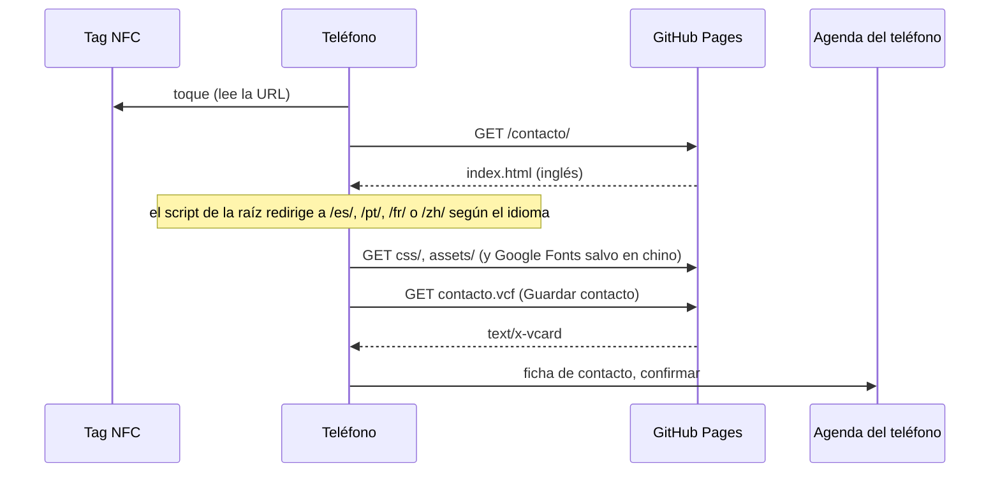

# Flujo del toque NFC

```mermaid
sequenceDiagram
  participant T as Tag NFC
  participant P as Teléfono
  participant G as GitHub Pages
  participant C as Agenda del teléfono
  P->>T: toque (lee la URL)
  P->>G: GET /contacto/
  G-->>P: index.html (inglés)
  Note over P: el script de la raíz redirige a /es/, /pt/, /fr/ o /zh/ según el idioma
  P->>G: GET css/, assets/ (y Google Fonts salvo en chino)
  P->>G: GET contacto.vcf (Guardar contacto)
  G-->>P: text/x-vcard
  P->>C: ficha de contacto, confirmar
```
